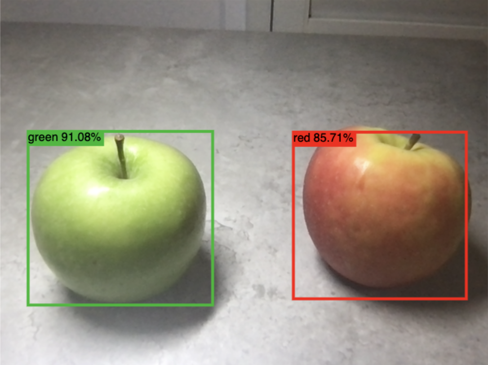

# Real-Time Object Detection Using TFJS

In my spare time I have been working on training a MobileNet object detection model that is able to distinguish between whether an apple is red or green. The model was trained on over 120 images containing apples gathered from Google Images, all in JPG format, which I manually labeled. The links provided below are the guides I followed to make this model along with the necessary code. I should also note that I tweaked the code so its more modern.

https://blog.tensorflow.org/2021/01/custom-object-detection-in-browser.html 
https://tensorflow-object-detection-api-tutorial.readthedocs.io/en/latest/install.html

Example screenshot of the model in action:

</img>

<br>
<br>

# Want to Try?
To get started simply:
  
  1) Git clone the repo 
```
git clone https://github.com/Keenans213/Data_Science_Projects.git
```
  2) Change to the required directory:
```
cd Green_Red_Apple_Detection_Model
```
  3) Install the http-server:
```
npm install http-server -g
```
  4) Install all the dependencies:
```
npm install
```
  5) Open two terminals and run the following:
```
# In terminal 1
cd web_model
http-server -c1 --cors .

# In terminal 2
npm run start
```

  6) The model will take a few seconds to load, and if loaded successfully you should see a lot of bounding boxes. Now adjust the threshold constant from 0.01 to 0.7 (line 13 of the index.js file) and show the camera some apples and it will be able to classify the color of those apples in real-time.

     * PLEASE NOTE: For optimal use make sure there is enough lighting so the colors of the apples really stand out.
   